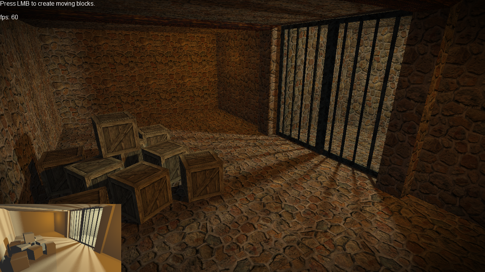

# GameMaker 8.1 3D Tech Pack
> 3D rendering tech samples created in GameMaker 8.1

# Table of Contents
* [About](#about)
* [Samples](#samples)

# About
Originally released in 2014, when we were switching from GameMaker 8.1 to GameMaker: Studio, now re-discovered in between our old backup files. This pack contains 3D rendering tech samples created in GameMaker 8.1, purely in GML, without any extensions. We are posting this on GitHub mostly for nostalgia reasons - feel free to utilize these as you like, but keep on mind that we are not developing these anymore!

# Samples
## Baked shadows

## Flashlight

## Flying demo

## Giant terrain

## Grass

## Post-processing

## Realtime shadows

## Texture streaming

## Water reflections

